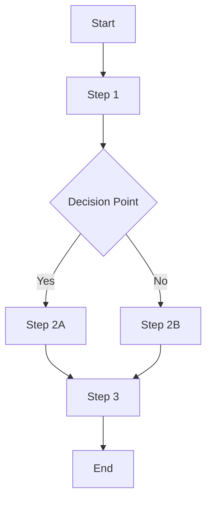
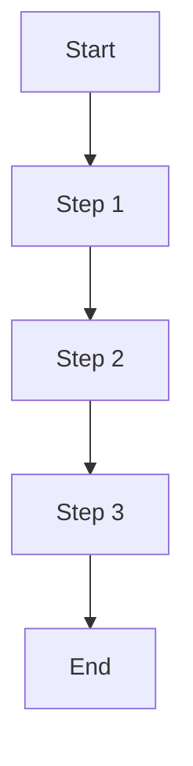

# 📋 **Business Requirements Document**
## [PROJECT_NAME] - Business Goals and Requirements

### 📋 **Document Overview**
- **Purpose**: Document business goals, objectives, and high-level requirements
- **When to Use**: After scope definition, before technical design
- **Who Uses**: Product Owner, Business Analysts, Stakeholders
- **Dependencies**: project-scope-definition.md
- **Version**: 1.0
- **Last Updated**: [DATE]

---

## 🎯 **EXECUTIVE SUMMARY**

### **Project Vision**
[Brief description of what the project aims to achieve and why it's important]

### **Business Objectives**
1. **[Objective 1]**: [Description and business value]
2. **[Objective 2]**: [Description and business value]
3. **[Objective 3]**: [Description and business value]

### **Success Criteria**
- [ ] **Success Metric 1**: [Specific, measurable criteria]
- [ ] **Success Metric 2**: [Specific, measurable criteria]
- [ ] **Success Metric 3**: [Specific, measurable criteria]

---

## 👥 **STAKEHOLDER ANALYSIS**

### **Primary Stakeholders**
| Stakeholder | Role | Responsibilities | Influence | Interest |
|-------------|------|------------------|-----------|----------|
| [Name] | [Role] | [Responsibilities] | High/Medium/Low | High/Medium/Low |
| [Name] | [Role] | [Responsibilities] | High/Medium/Low | High/Medium/Low |

### **Secondary Stakeholders**
| Stakeholder | Role | Responsibilities | Influence | Interest |
|-------------|------|------------------|-----------|----------|
| [Name] | [Role] | [Responsibilities] | High/Medium/Low | High/Medium/Low |

### **External Stakeholders**
| Stakeholder | Role | Responsibilities | Influence | Interest |
|-------------|------|------------------|-----------|----------|
| [Name] | [Role] | [Responsibilities] | High/Medium/Low | High/Medium/Low |

---

## 🎯 **BUSINESS GOALS AND OBJECTIVES**

### **Primary Business Goals**
1. **Goal 1**: [Specific, measurable goal]
   - **Rationale**: [Why this goal is important]
   - **Success Metrics**: [How success will be measured]
   - **Timeline**: [When this goal should be achieved]

2. **Goal 2**: [Specific, measurable goal]
   - **Rationale**: [Why this goal is important]
   - **Success Metrics**: [How success will be measured]
   - **Timeline**: [When this goal should be achieved]

3. **Goal 3**: [Specific, measurable goal]
   - **Rationale**: [Why this goal is important]
   - **Success Metrics**: [How success will be measured]
   - **Timeline**: [When this goal should be achieved]

### **Secondary Business Goals**
1. **Goal 1**: [Specific, measurable goal]
2. **Goal 2**: [Specific, measurable goal]
3. **Goal 3**: [Specific, measurable goal]

---

## 👤 **USER STORIES**

### **Primary User Stories**
| ID | User Story | Priority | Acceptance Criteria |
|----|------------|----------|-------------------|
| US-001 | As a [user type], I want [goal] so that [benefit] | High | - [Criterion 1] - [Criterion 2] - [Criterion 3] |
| US-002 | As a [user type], I want [goal] so that [benefit] | High | - [Criterion 1] - [Criterion 2] - [Criterion 3] |
| US-003 | As a [user type], I want [goal] so that [benefit] | Medium | - [Criterion 1] - [Criterion 2] - [Criterion 3] |

### **Secondary User Stories**
| ID | User Story | Priority | Acceptance Criteria |
|----|------------|----------|-------------------|
| US-004 | As a [user type], I want [goal] so that [benefit] | Medium | - [Criterion 1] - [Criterion 2] |
| US-005 | As a [user type], I want [goal] so that [benefit] | Low | - [Criterion 1] - [Criterion 2] |

---

## 🔧 **BUSINESS RULES**

### **Core Business Rules**
1. **Rule 1**: [Description of business rule]
   - **Scope**: [When this rule applies]
   - **Exceptions**: [Any exceptions to this rule]
   - **Impact**: [How this rule affects the system]

2. **Rule 2**: [Description of business rule]
   - **Scope**: [When this rule applies]
   - **Exceptions**: [Any exceptions to this rule]
   - **Impact**: [How this rule affects the system]

3. **Rule 3**: [Description of business rule]
   - **Scope**: [When this rule applies]
   - **Exceptions**: [Any exceptions to this rule]
   - **Impact**: [How this rule affects the system]

### **Data Business Rules**
1. **Data Rule 1**: [Description of data-related business rule]
2. **Data Rule 2**: [Description of data-related business rule]
3. **Data Rule 3**: [Description of data-related business rule]

### **Process Business Rules**
1. **Process Rule 1**: [Description of process-related business rule]
2. **Process Rule 2**: [Description of process-related business rule]
3. **Process Rule 3**: [Description of process-related business rule]

---

## 📊 **BUSINESS PROCESS FLOWS**

### **Primary Business Process**

### **Secondary Business Process**

---

## 📈 **SUCCESS METRICS AND KPIs**

### **Key Performance Indicators**
| KPI | Target | Current | Measurement Method | Frequency |
|-----|--------|---------|-------------------|-----------|
| [KPI 1] | [Target Value] | [Current Value] | [How to measure] | [How often] |
| [KPI 2] | [Target Value] | [Current Value] | [How to measure] | [How often] |
| [KPI 3] | [Target Value] | [Current Value] | [How to measure] | [How often] |

### **Business Metrics**
1. **Metric 1**: [Description and target]
2. **Metric 2**: [Description and target]
3. **Metric 3**: [Description and target]

### **User Experience Metrics**
1. **User Satisfaction**: [Target and measurement method]
2. **User Adoption**: [Target and measurement method]
3. **User Retention**: [Target and measurement method]

---

## 💰 **BUSINESS VALUE AND ROI**

### **Expected Business Value**
1. **Cost Savings**: [Expected cost savings and calculation]
2. **Revenue Increase**: [Expected revenue increase and calculation]
3. **Efficiency Gains**: [Expected efficiency improvements]
4. **Risk Reduction**: [Expected risk reduction]

### **Return on Investment**
- **Total Investment**: [Total project cost]
- **Expected Annual Savings**: [Expected annual savings]
- **Payback Period**: [Time to recover investment]
- **ROI Percentage**: [Return on investment percentage]

### **Intangible Benefits**
1. **Benefit 1**: [Description of intangible benefit]
2. **Benefit 2**: [Description of intangible benefit]
3. **Benefit 3**: [Description of intangible benefit]

---

## 🚫 **CONSTRAINTS AND LIMITATIONS**

### **Business Constraints**
1. **Constraint 1**: [Description of business constraint]
   - **Impact**: [How this constraint affects the project]
   - **Mitigation**: [How to work around this constraint]

2. **Constraint 2**: [Description of business constraint]
   - **Impact**: [How this constraint affects the project]
   - **Mitigation**: [How to work around this constraint]

### **Regulatory Constraints**
1. **Regulation 1**: [Description of regulatory requirement]
2. **Regulation 2**: [Description of regulatory requirement]

### **Technical Constraints**
1. **Technical Constraint 1**: [Description of technical limitation]
2. **Technical Constraint 2**: [Description of technical limitation]

---

## 🔄 **CHANGE MANAGEMENT**

### **Scope Change Process**
1. **Change Request**: [How to submit a change request]
2. **Impact Assessment**: [How to assess the impact of changes]
3. **Approval Process**: [Who needs to approve changes]
4. **Implementation**: [How changes will be implemented]

### **Change Control Board**
| Role | Name | Responsibilities |
|------|------|------------------|
| [Role] | [Name] | [Responsibilities] |
| [Role] | [Name] | [Responsibilities] |

---

## 📋 **ACCEPTANCE CRITERIA**

### **Overall Project Acceptance**
- [ ] **Criterion 1**: [Specific, measurable acceptance criterion]
- [ ] **Criterion 2**: [Specific, measurable acceptance criterion]
- [ ] **Criterion 3**: [Specific, measurable acceptance criterion]

### **Feature Acceptance Criteria**
| Feature | Acceptance Criteria |
|---------|-------------------|
| [Feature 1] | - [Criterion 1] - [Criterion 2] - [Criterion 3] |
| [Feature 2] | - [Criterion 1] - [Criterion 2] - [Criterion 3] |

---

## 📚 **APPENDICES**

### **Appendix A: Glossary**
| Term | Definition |
|------|------------|
| [Term 1] | [Definition] |
| [Term 2] | [Definition] |
| [Term 3] | [Definition] |

### **Appendix B: References**
1. **[Reference 1]**: [Description and link]
2. **[Reference 2]**: [Description and link]
3. **[Reference 3]**: [Description and link]

### **Appendix C: Assumptions**
1. **Assumption 1**: [Description of assumption]
2. **Assumption 2**: [Description of assumption]
3. **Assumption 3**: [Description of assumption]

---

## ✅ **APPROVAL AND SIGN-OFF**

### **Stakeholder Approvals**
| Stakeholder | Role | Approval Date | Signature |
|-------------|------|---------------|-----------|
| [Name] | [Role] | [Date] | [Signature] |
| [Name] | [Role] | [Date] | [Signature] |
| [Name] | [Role] | [Date] | [Signature] |

### **Document Control**
- **Version**: [Version number]
- **Last Updated**: [Date]
- **Next Review**: [Date]
- **Approval Status**: [Approved/Pending/In Review]

---

## 📝 **CHANGE LOG**

| Version | Date | Author | Changes |
|---------|------|--------|---------|
| 1.0 | [Date] | [Author] | Initial version |
| 1.1 | [Date] | [Author] | [Description of changes] |

---

**Document Control:**
- **Next Review Date**: [Date]
- **Approval Required**: [Role]
- **Distribution**: [List of recipients]
- **Version**: 1.0
- **Last Updated**: [Date] 